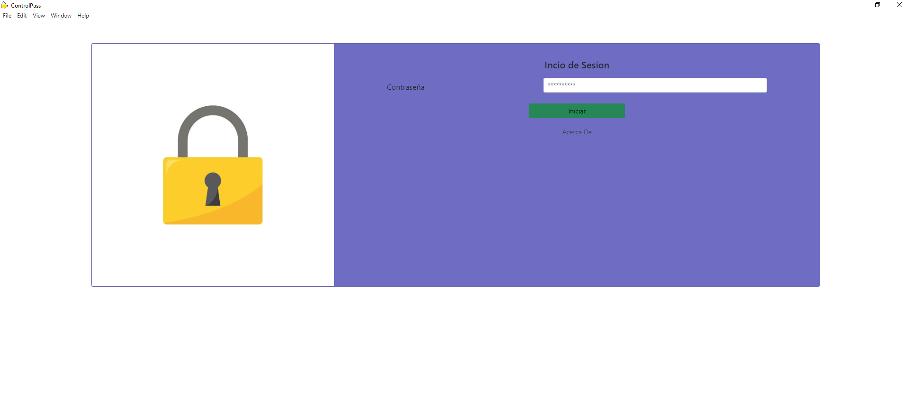

# ControlPass

## **Steps**
- Dependency installation: 
    `npm install`
- To test without compiling run the command:
    `npm run dev` this will raise the react server and run electron
- Compile:
    `npm run tbuild` this will compile the react application and then compile electron together with the react build and dependencies.

---

## **Application view**
- _Registration:_

- _Login:_

- _List:_

- _New/Edit:_

- _Configuration:_

- _Delete:_

- _Dark Mode:_

---

## **Tools**
- [React App](https://es.reactjs.org)
- [Electron Js](https://www.electronjs.org)
- [Bootstrap](https://getbootstrap.com)
- [Animate.css](https://animate.style)
- [SQLite - Installation](https://www.npmjs.com/package/sqlite3)
- [SQLite - Documentation](https://www.sqlitetutorial.net/sqlite-nodejs)

---

## **Objective**
The purpose of this application is to give a personal use, to keep centralized all my login passwords of my online accounts, this idea arises from the problem of forgetting the passwords of more than 50 accounts in different web platforms, we started storing the passwords in the web browser, but they were stored without encryption, so it was vulnerable to a malware attack.
I started this small project to practice my programming knowledge, and learn more about React, since I always wanted to learn how to use this tool.

Also to share and make my knowledge known, as well as to give a tool to those who may find it useful, both to use and centralize their passwords, as an example of React programming and communication with Electron.

_Finally, I always wanted to learn how to create my own encryption code and go advanced to a more advanced encryption code._

---

## **Simple operation**
- **Log out or log out:** Click on the padlock icon at the top left.
- **View list of passwords:** Menu, click Home.
- **Add new:** Menu, click New and fill in the fields.
- **Edit:** In Home, see the list of passwords on the right side is the button to edit.
- **Delete:** In Home, see the list of passwords on the right side is the Delete button.
- **Dark/Light Mode:** Switch between dark and light mode.

---

## **Deep Functioning**
Aggregated passwords are stored in a database, each password is encrypted and in order to be decrypted correctly the application login password is required.
The login password is kept in the database and remains encrypted, so if a Black Hat extracts this data it will not be able to decrypt the stored information, if or if the login password is required.

You can modify the login key, in the process, all passwords will be decrypted and encrypted with the new login key.

You can make copies of the database, these copies are as the database is, with encrypted passwords and encrypted login key, exports in _CSV_ format are made with decrypted passwords, so it will be fully visible to anyone who has access to the _CSV_, you can import the file, at the time of import will be encrypted with the login password that is registered at the time of import.

---

## **Note**
The code comments are in **Spanish**, that is my primary and birth language.

---

## Author
**Marco**
